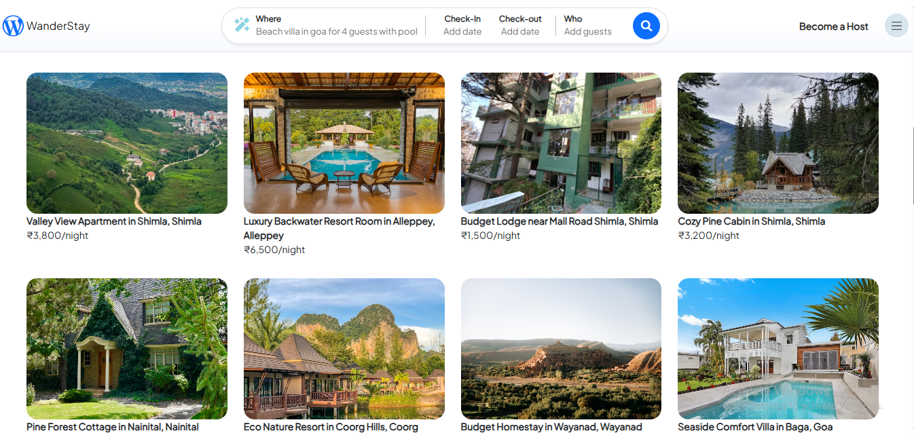
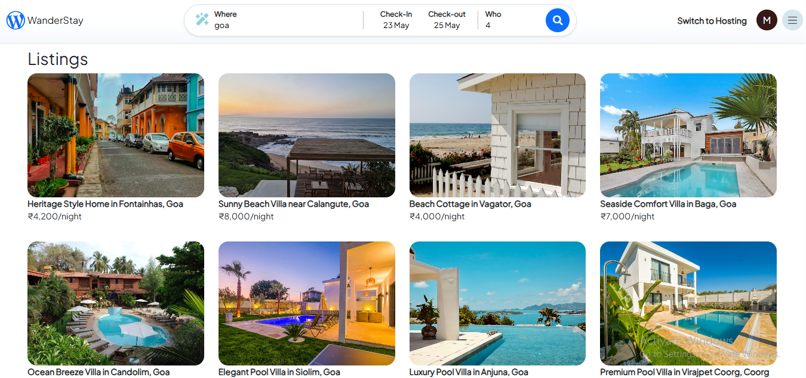
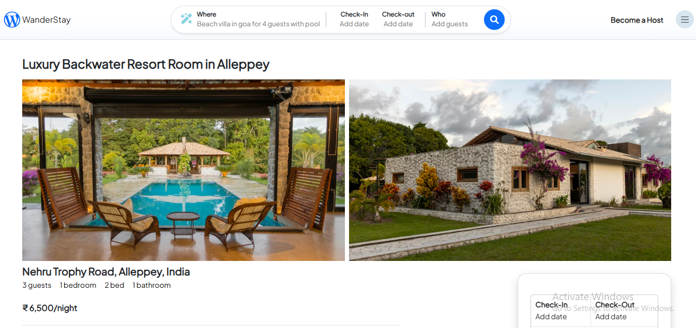
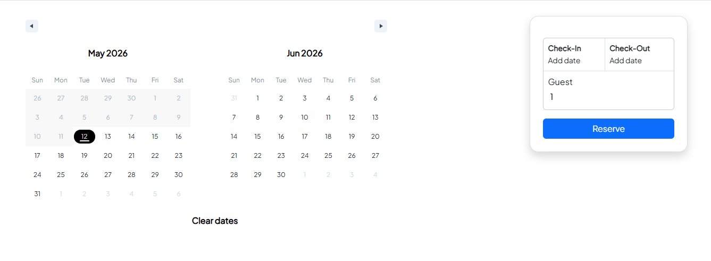
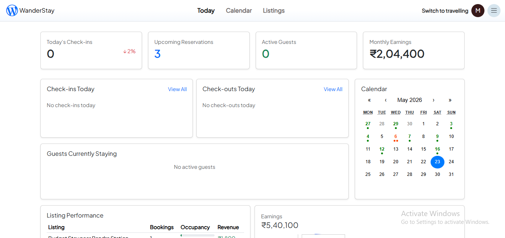
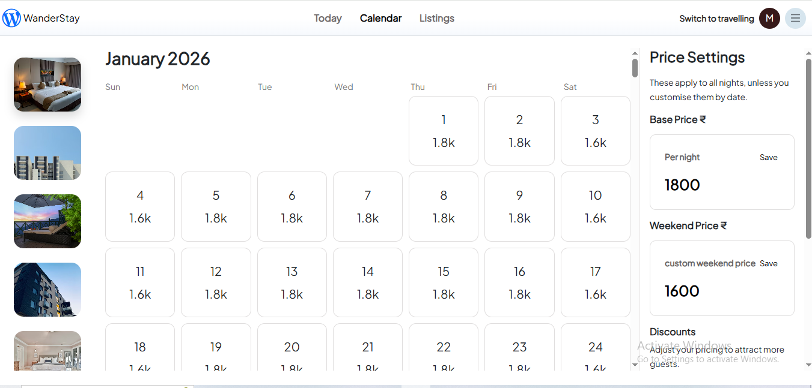
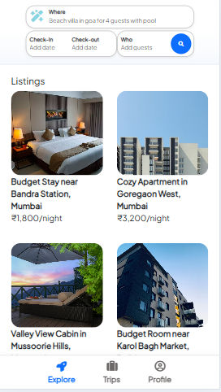

# WanderStay

WanderStay is a full-stack travel stay booking platform inspired by modern rental marketplaces. It includes property discovery, AI-powered search, listing details, date-based booking, user trips, host listing management, image uploads, pricing controls, calendar availability, and dashboard analytics.

The project is built to demonstrate frontend product thinking, responsive UI development, API integration, state management, form handling, and real-world booking workflows.

## Preview









## Features

- User authentication with protected routes
- Browse available listings
- AI-powered natural language search
- Search by destination, guests, and dates
- Listing detail page with images, amenities, reviews, map, and booking card
- Date selection with booked-date handling
- Booking availability check before reservation
- User profile and trip history
- Host mode with separate host navigation
- Create, edit, and delete listings
- Upload and manage listing images by room or space
- Host calendar for availability and custom date pricing
- Price settings for base price, weekend price, weekly discount, and monthly discount
- Host dashboard analytics for bookings, occupancy, and revenue
- Responsive layout for desktop and mobile views

## Tech Stack

**Frontend**

- React
- React Router
- React Hook Form
- Axios
- Bootstrap
- React Icons
- React Calendar and date range tools
- Recharts
- Mapbox GL
- React Loading Skeleton

**Backend**

- Node.js
- Express.js
- MongoDB
- Mongoose
- Passport authentication
- Cloudinary image storage
- Mapbox geocoding and maps
- OpenAI-powered search utilities

## Frontend Highlights

- Route-based user and host experiences
- Protected pages for authenticated users
- Reusable booking, calendar, listing, profile, and dashboard       components
- Search state caching with React Context
- Loading skeletons for listing results
- Responsive navigation for mobile and desktop
- Form validation using React Hook Form
- Production build cleaned of ESLint warnings

## Project Structure

```txt
WanderStay/
|-- backend/
|   |-- controllers/
|   |-- models/
|   |-- routes/
|   |-- services/
|   |-- utils/
|   |-- app.js
|   `-- package.json
|-- frontend/
|   |-- public/
|   |-- src/
|   |   |-- components/
|   |   |-- context/
|   |   |-- app.js
|   |   `-- index.js
|   `-- package.json
`-- README.md
```

## Getting Started

### 1. Clone the repository

```bash
git clone <your-repository-url>
cd WanderStay
```

### 2. Install backend dependencies

```bash
cd backend
npm install
```

### 3. Install frontend dependencies

```bash
cd ../frontend
npm install
```

## Environment Variables

Create a `.env` file inside the `backend` folder.

```env
ATLASDB_URL=your_mongodb_connection_string
SECRET=your_session_secret
CLOUD_NAME=your_cloudinary_cloud_name
CLOUD_API_KEY=your_cloudinary_api_key
CLOUD_API_SECRET=your_cloudinary_api_secret
MAP_TOKEN=your_mapbox_token
OPENAI_API_KEY=your_openai_api_key
```

Create a `.env` file inside the `frontend` folder.

```env
REACT_APP_API_URL=http://localhost:8080
REACT_APP_MAP_TOKEN=your_mapbox_token
```

Update variable names if your local backend uses different names.

## Run Locally

Start the backend:

```bash
cd backend
npm start
```

Start the frontend:

```bash
cd frontend
npm start
```

The frontend runs on:

```txt
http://localhost:3000
```

## Build

```bash
cd frontend
npm run build
```

The frontend production build compiles successfully.

## Main User Flows

### Guest/User Flow

1. Browse listings from the homepage.
2. Search using location, dates, guests, or natural language.
3. Open a listing detail page.
4. Select check-in and check-out dates.
5. Reserve the listing after availability is checked.
6. View upcoming and past trips from the profile page.

### Host Flow

1. Create a new listing.
2. Add listing details and images.
3. Manage listings from the host dashboard.
4. Update pricing and discounts.
5. Manage calendar availability.
6. View listing performance analytics.

## Screenshots


## What I Learned

- Building a multi-page React application with protected routing
- Managing user and host experiences in one product
- Handling API-driven loading, empty, and error states
- Creating calendar-based booking and pricing flows
- Integrating maps, image uploads, authentication, and dashboards
- Improving build quality by resolving React and ESLint warnings

## Future Improvements

- Add route-level code splitting to reduce bundle size
- Replace browser alerts with toast notifications or modals
- Add stronger error handling across booking and image upload flows
- Improve accessibility and keyboard navigation
- Add unit and integration tests for search, auth, and booking
- Add payment integration
- Deploy frontend and backend with production environment variables

## Author

Built by **Manisha Kumari**.

- GitHub: `https://github.com/manisha-2976/WanderStay`
- LinkedIn: `https://www.linkedin.com/in/manisha-kumari-b37565214/?lipi=urn%3Ali%3Apage%3Ad_flagship3_profile_view_base_contact_details%3BOaDPjrCRQ5C25vwgknmt7g%3D%3D`
- Live Demo: `https://wanderstay-frontend-fqg1.onrender.com`
